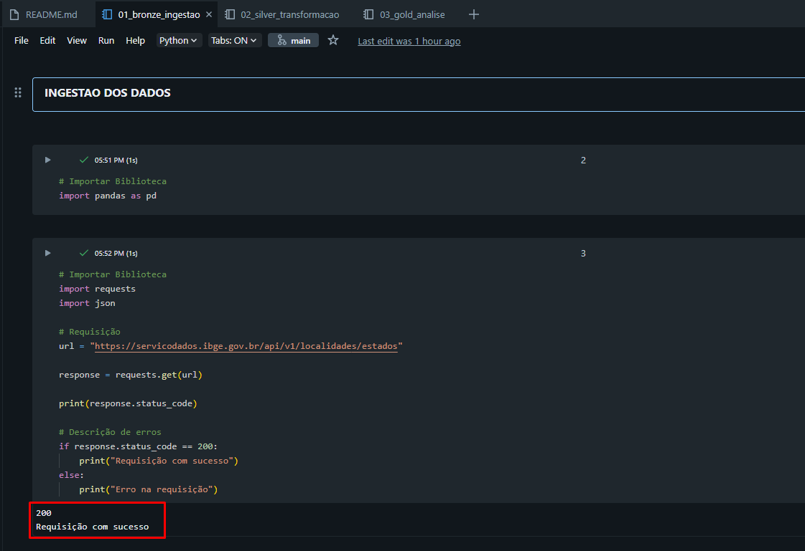
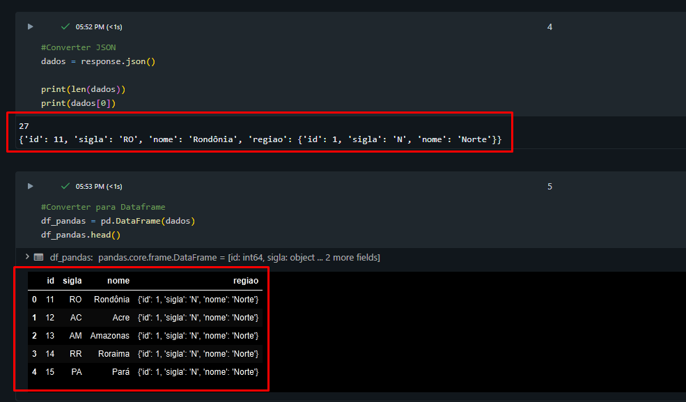
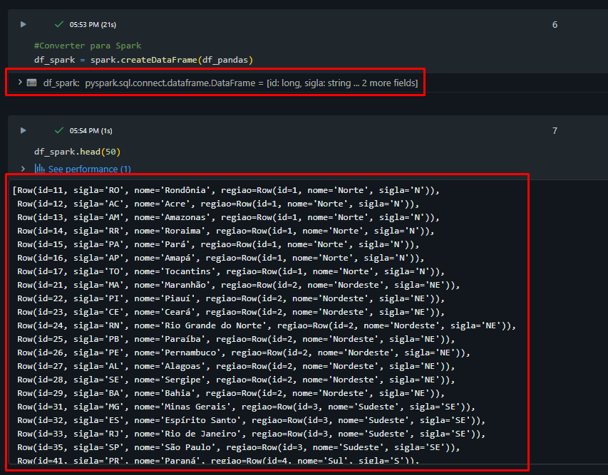
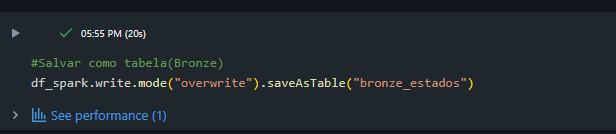
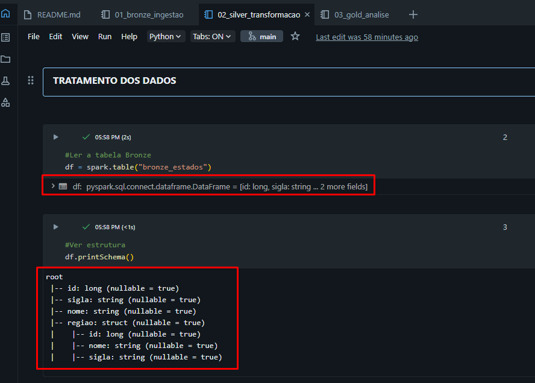
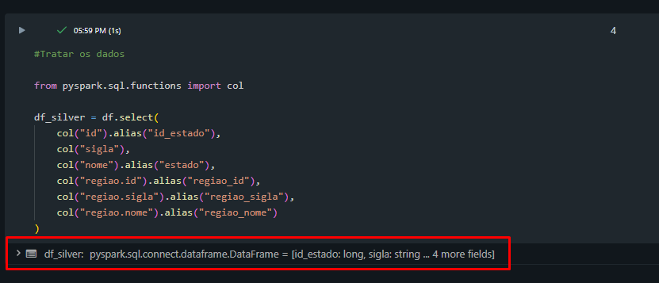
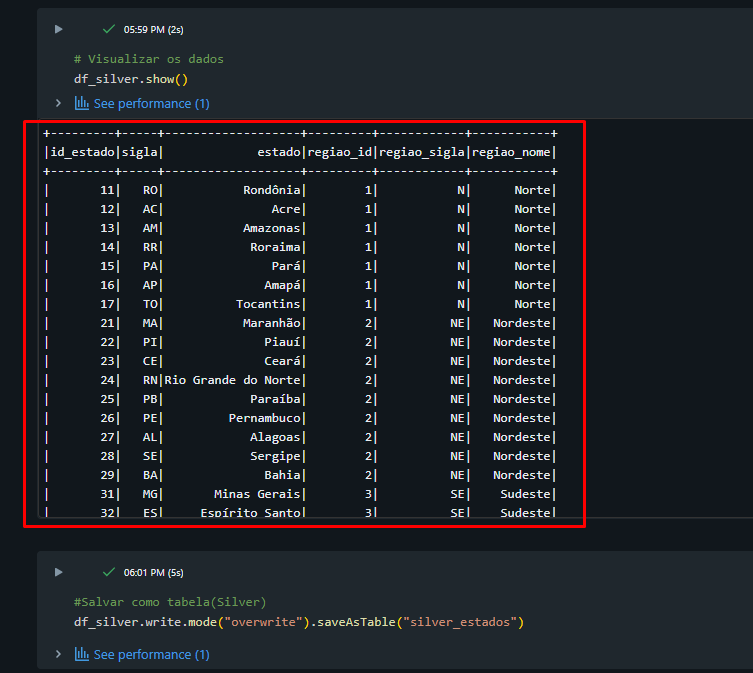
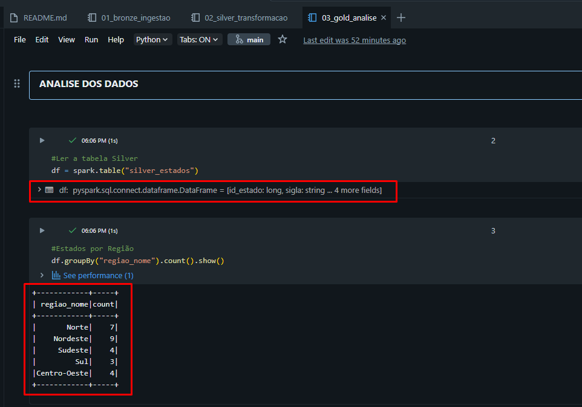
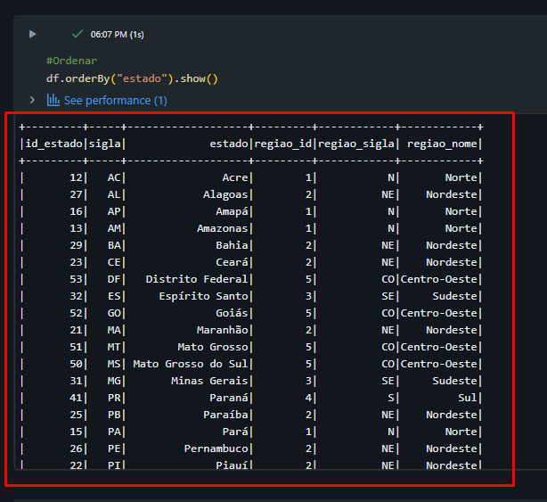
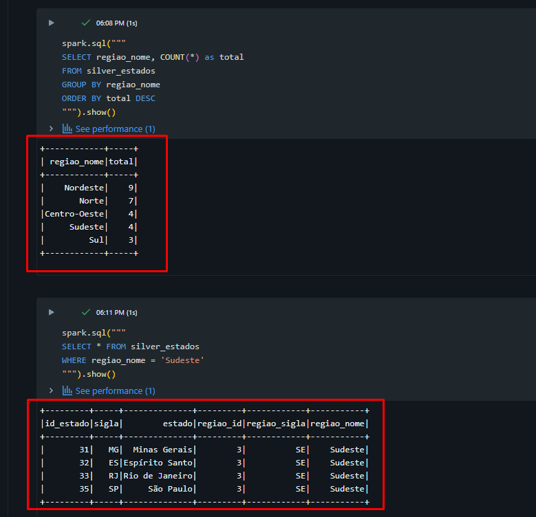

# 🇧🇷 IBGE Data Pipeline

Pipeline de dados construído com Python e PySpark utilizando dados públicos da API do IBGE.

Este projeto demonstra na prática conceitos de Engenharia de Dados, como ingestão, transformação e análise de dados utilizando arquitetura em camadas (Bronze, Silver e Gold).

## 🎯 Objetivo

Construir um pipeline de dados completo consumindo dados de uma API pública, organizando-os em diferentes camadas e gerando informações analíticas.

## 🚀 Tecnologias utilizadas

- Python
- PySpark
- Databricks
- API REST

## 🧱 Arquitetura do pipeline

O projeto segue o modelo de arquitetura em camadas:

API IBGE
↓
Bronze (dados crus)
↓
Silver (dados tratados)
↓
Gold (dados analíticos)

## 📊 Fonte de dados

Dados obtidos através da API pública do IBGE:

https://servicodados.ibge.gov.br/api/v1/localidades/estados

## 🔄 Pipeline

### 🥉 Bronze — Ingestão
- Consumo da API do IBGE
- Conversão de JSON para DataFrame
- Armazenamento dos dados brutos

## Segue o passo a passo em imagens: 

### Etapa 1 — Requisição na API

### Etapa 2 — Conversão para JSON

### Etapa 3 — DataFrame

### Etapa 4 — Resultado

### 🥈 Silver — Transformação
- Tratamento de dados aninhados (JSON)
- Normalização da estrutura
- Criação de colunas analíticas

## Segue o passo a passo em imagens:

### Etapa 1 — Leitura da camada Bronze

### Etapa 2 — Tratamento dos dados (flatten)

### Etapa 3 — Resultado final da transformação

### 🥇 Gold — Análise
- Agregações
- Consultas analíticas
- Preparação para visualização

## Segue o passo a passo em imagens:

### Etapa 1 — Leitura da camada Silver

### Etapa 2 — Criação de agregações

### Etapa 3 — Resultado final para análise

## 📁 Estrutura do projeto

ibge-data-pipeline/
│
├── notebooks/
│ ├── 01_bronze_ingestao.py
│ ├── 02_silver_transformacao.py
│ └── 03_gold_analise.py
│
├── imagens/
├── README.md

## 🧠 Aprendizados

- Consumo de APIs REST
- Manipulação de JSON
- Uso de PySpark
- Arquitetura de dados em camadas

## 🚀 Melhorias futuras

- Incluir dados de municípios
- Criar pipeline automatizado
- Construir dashboard

## 👨‍💻 Autor

Projeto desenvolvido para fins de estudo em Engenharia de Dados.
